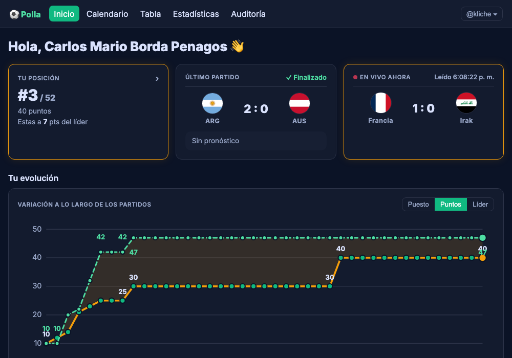
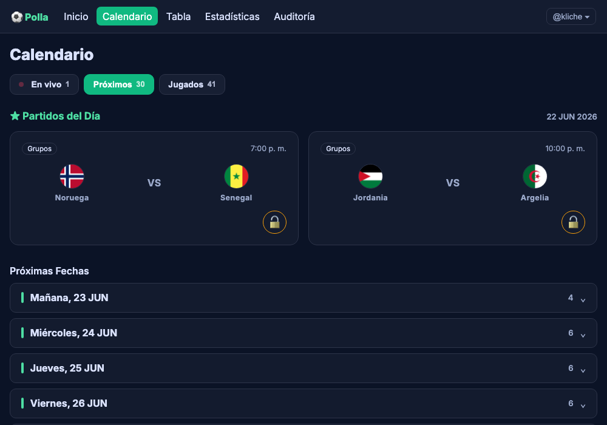
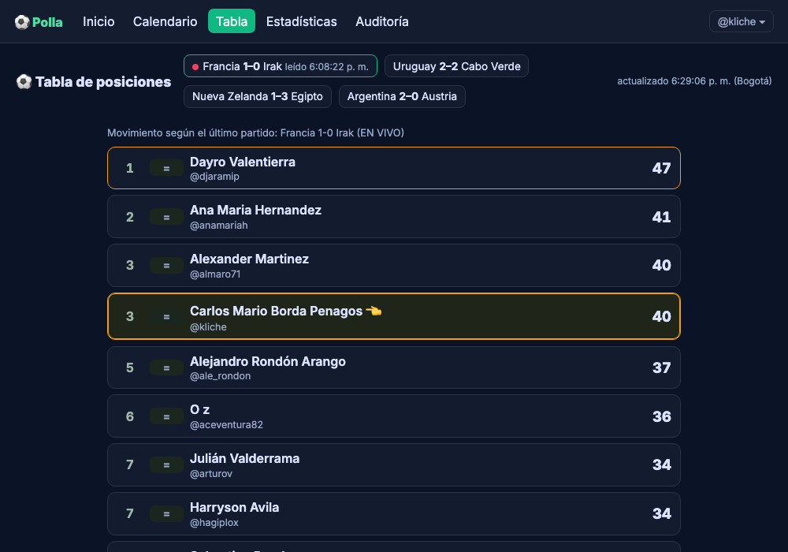
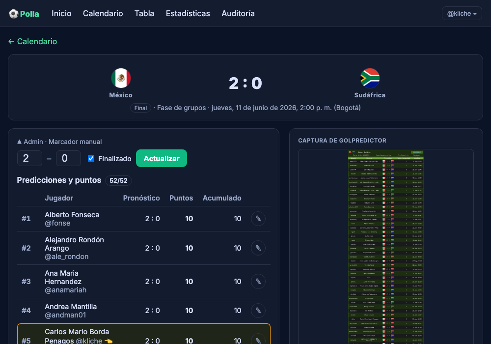
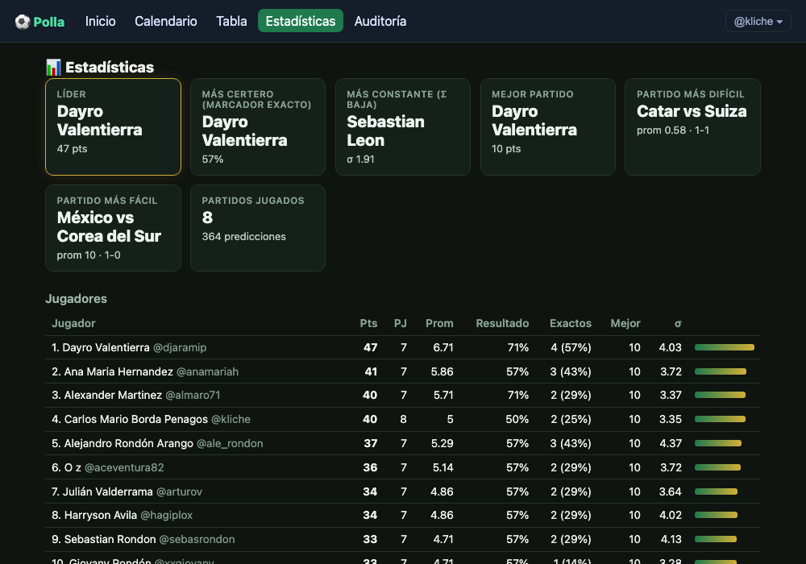

# ⚽ Polla — Live World Cup Prediction Standings

> A real-time standings engine for a private prediction pool, built on top of a
> third-party platform that deliberately doesn't show you the live table.

**Polla** is a FastAPI web app that ingests World Cup score predictions from
screenshots (via vision OCR), tracks live match scores, and recomputes the
entire group's standings **on every score change** — something the platform
the group actually plays on does not offer.



---

## 1. The problem

A group of ~50 family and friends predicts every World Cup 2026 match score on
[Golpredictor](https://www.golpredictor.com), a third-party prediction site.
Golpredictor is fine for what it does — it locks everyone's picks 10 minutes
before kickoff and awards points once a match ends — but it has one gap that
bugged the group every single match day:

> **While a match is being played, nobody can see how the standings are
> moving.** You only find out who gained or lost ground *after* the final
> whistle, by refreshing a static page.

The group's workaround was sharing Golpredictor screenshots over WhatsApp and
manually guessing who was ahead. That's the actual problem this project
solves: **turn a static, post-match table into a live one**, without asking
Golpredictor for an API it doesn't have, and without anyone re-typing 50
people's predictions by hand every round.

## 2. The core idea

The insight that makes this tractable: once Golpredictor locks a match,
**predictions never change again.** The only thing that moves during a game
is the real score. So the live standings are a pure function of two inputs
that update at completely different rhythms:

```
live_standings = scoring_engine(frozen_predictions, current_live_score)
```

- **Predictions** — captured once per match, well before kickoff, from a
  screenshot of Golpredictor's own prediction table.
- **Live score** — polled every 30–120 seconds while a match is in progress.

Because of this split, standings are **never stored** — they're recomputed
from scratch on every request. There's no "sync the score, then go update
everyone's points" step to get wrong; a new score and a fresh standings table
are the same database read away.

## 3. How the data actually gets in

This is the part that made the project interesting to build: neither input
comes from a clean API. Both had to be reverse-engineered or extracted from
something meant for humans to read, not machines.

### 3.1 Predictions: vision OCR, not a scraper

Golpredictor requires a login and has no API, so scraping it was ruled out
early (fragile, and arguably against its terms). Instead, **a human takes a
screenshot of the prediction table and uploads it** — the same screenshot the
group already shares on WhatsApp. The app reads that image with a vision
model (Google Gemini, free tier) and turns it into structured rows:

```
Screenshot of Golpredictor's prediction table
        │  (Gemini 2.5 Flash vision, app/ocr.py)
        ▼
CSV: usuario,nombre,pronostico_local,pronostico_visitante
        │  (fuzzy-match against the roster, app/matching.py)
        ▼
Reviewed in-browser, confirmed by a human
        │  (idempotent upsert, app/ingest.py)
        ▼
predictions table (locked — this match can't be re-uploaded)
```

**OCR output is never saved directly.** A misread digit on one screenshot
would silently corrupt one person's score for an entire match, so every
upload lands on a review screen first — the human confirms or fixes a row
before anything touches the database. Once confirmed, the match is locked:
no accidental re-uploads.

The matching step (`app/matching.py`) is the part that turns "OCR is
approximately right" into "the data is exactly right": each row resolves to
a real participant through a cascade — **exact username → fuzzy username
(edit-distance ≤ 20%) → exact display name** — and reports anyone the
screenshot is missing so the uploader knows immediately, before locking:

```python
>>> match_and_validate(
...     ocr_rows=[{"username": "kilche", "display_name": "Carlos M.", "pred_home": 2, "pred_away": 1}],
...     top=None, uploader="kliche",
...     participants=[("kliche", "Carlos Mario Borda Penagos"), ...],
... )
# "kilche" (OCR typo) -> fuzzy-matches "kliche" -> resolved with the STORED display name
{"predictions": [{"username": "kliche", "display_name": "Carlos Mario Borda Penagos",
                   "pred_home": 2, "pred_away": 1, "match": "fuzzy"}], ...}
```

### 3.2 Live scores: a free public endpoint, polled and self-healing

There's no official, free, real-time World Cup score API. The live provider
(`app/scores/scores365.py`) calls the same undocumented JSON endpoint
365scores.com's own website widgets use — no key, no registration. It's
wrapped behind a small interface (`ScoreProvider`) so the rest of the app
never depends on *which* provider is active:

```python
class ScoreProvider(Protocol):
    def fetch_games(self) -> list[ProviderGame]: ...
```

A background job (APScheduler) polls it every 30–120 seconds, but **only**
when some match is near kickoff (`has_live_window`) — there's no point
hammering a free endpoint at 3am for a tournament that plays at noon. The
first time a game is seen, it's auto-linked to our match **by team name**
and the link is persisted, so every poll after that is a direct id lookup.

The catch: predictions are entered in **Spanish** ("Sudáfrica", "Países
Bajos") and the score provider speaks **English** ("South Africa",
"Netherlands"). `app/teams.py` holds the alias map that bridges the two
sides, and `normalize_team()` strips accents so `México`/`Mexico` match for
free without needing an entry at all:

```python
>>> normalize_team("Sudáfrica")   # alias map: sudafrica -> south africa
'south africa'
>>> normalize_team("México")      # accent-stripped, no alias needed
'mexico'
```

If the provider's endpoint ever goes down, changes shape, or simply doesn't
cover a match — admins can always set/override a score by hand
(`POST /matches/{id}/score`). The live system is a convenience layer on top
of a feature that works without it.

### 3.3 Scoring: validated against the platform it mirrors

Each prediction earns points from **four independent, additive components**
(values double in knockout rounds), implemented in `app/scoring.py` and
checked against real Golpredictor results so the numbers actually match:

| Component                  | Group | Knockout |
|-----------------------------|:-----:|:--------:|
| Correct result (W/D/L)      |   5   |    10    |
| Correct home-team goals     |   2   |    4     |
| Correct away-team goals     |   2   |    4     |
| Correct goal difference     |   1   |    2     |
| **Max (exact score)**       | **10**| **20**   |

```python
>>> score_prediction(pred_home=2, pred_away=0, actual_home=2, actual_away=0)
ScoreBreakdown(result=5, home_goals=2, away_goals=2, goal_difference=1)  # total 10 — exact
>>> score_prediction(pred_home=1, pred_away=0, actual_home=2, actual_away=0)
ScoreBreakdown(result=5, home_goals=0, away_goals=2, goal_difference=0)  # total 7
```
(Validated against the real México 2–0 Sudáfrica match: a `1-0` prediction
scored exactly 7 — result + away goals.)

## 4. What it looks like

|  |  |
|---|---|
|  |  |
| **Calendar** — today's matches as cards, the rest grouped by date | **Live board** — full standings, reorders mid-match |
|  |  |
| **Match detail** — every prediction next to the screenshot it came from | **Analytics** — leader, accuracy, consistency, toughest match |

## 5. Features

- **Live standings** that recompute on every score change, with a movement
  indicator (▲/▼) since the last finished match.
- **Per-match upload window** — opens 10 min before kickoff, stays open until
  the match ends; admins can force it open for a match whose screenshot never
  came through.
- **Personalized home page** — your rank, your last match's prediction vs.
  result, and an evolution chart (rank / points / gap-to-leader over time,
  with the leader's own trajectory overlaid for comparison).
- **Analytics dashboard** — leader, most-exact predictor, steadiest scorer
  (lowest variance), toughest/easiest match of the tournament, per-player
  breakdown by scoring component.
- **Audit tool** — OCR a Golpredictor *standings* screenshot and diff it
  against our own computed points, to catch any scoring-rule mismatch.
- **First-party engagement analytics** — anonymous-until-identified visit
  tracking (active time-on-page), no third-party trackers.

## 6. Architecture at a glance

```
                    ┌─────────────────────┐        ┌──────────────────────┐
WhatsApp screenshot │   Vision OCR (Gemini)│        │  365scores.com (poll) │  background job,
   ───────────────► │  + human confirm     │        │  free, no auth        │  live-window gated
                    └──────────┬───────────┘        └──────────┬───────────┘
                               ▼                                ▼
                    predictions (frozen)                  matches.score (live)
                               │                                │
                               └───────────────┬────────────────┘
                                                ▼
                                  scoring_engine(predictions, score)
                                       computed on every read
                                                ▼
                                     live standings (never stored)
```

## 7. Tech stack

| Layer | Choice | Why |
|---|---|---|
| Language | Python 3.11 | |
| Web framework | FastAPI + Uvicorn | async, typed, fast to iterate |
| ORM / DB | SQLAlchemy 2.0 → MySQL in prod, SQLite for tests/dev | one model, swap the URL |
| OCR | Google Gemini 2.5 Flash (vision), Claude vision as a swappable alternative | free tier, structured-enough output for CSV parsing |
| Live scores | `httpx` against a free undocumented endpoint, behind a provider interface | swappable without touching the rest of the app |
| Background jobs | APScheduler (in-process) | simplest thing that works for a single-worker deploy |
| Frontend | Plain HTML + vanilla JS, no build step, no framework | a few thousand lines doesn't need a bundler |
| Tests | pytest, 40 tests, all on SQLite, no network | scoring/standings/matching are pure and heavily tested |

## 8. Run it locally

```bash
python3 -m venv .venv && source .venv/bin/activate
pip install -r requirements.txt
cp .env.example .env
echo 'DB_URL=sqlite:///./polla_dev.db' >> .env   # skip this to use MySQL instead (see DEPLOY.md)
pytest                                           # 40 tests — conftest.py forces its own throwaway SQLite, ignoring .env
uvicorn app.main:app --reload
```

Drive a match live without waiting for a real one. A fresh DB starts with no
fixtures, and both endpoints below are admin-only (`kliche` is the default
admin in `.env.example`):
```bash
curl -X POST localhost:8000/matches -H 'content-type: application/json' -b 'polla_user=kliche' \
  -d '{"home_team":"México","away_team":"Sudáfrica","kickoff_utc":"2026-06-11T19:00:00"}'
# -> {"id": 1, "status": "scheduled", ...}

curl -X POST localhost:8000/matches/1/score -H 'content-type: application/json' -b 'polla_user=kliche' \
  -d '{"home_score":1,"away_score":0}'
# open /calendar or /board — the match flips to LIVE with a 1-0 score, then:
curl -X POST localhost:8000/matches/1/score -H 'content-type: application/json' -b 'polla_user=kliche' \
  -d '{"home_score":2,"away_score":0,"finished":true}'
# -> FINISHED 2-0, and any predictions confirmed against this match now have points
```

## 9. Project layout

```
app/
  scoring.py     # pure scoring engine — the heart of the system
  standings.py   # ranks participants live from predictions + scores
  ocr.py         # vision OCR -> structured prediction rows (Gemini / Claude)
  matching.py    # OCR rows -> real participants (exact -> fuzzy -> name)
  ingest.py      # human-reviewed, idempotent save of predictions
  scores/        # swappable live-score providers (base + scores365 + worldcup_free)
  poller.py      # applies provider scores to matches, auto-links by team name
  teams.py       # Spanish -> English team-name aliases
  analytics.py   # KPIs over finished matches
  tracking.py    # first-party page-visit / engagement analytics
  main.py        # FastAPI routes
web/             # calendar, board, match, upload, home, analytics, audit — vanilla HTML/JS
tests/           # scoring, standings, matching, poller, analytics, tracking, full HTTP flow
```

## 10. Going deeper

This README is the pitch. For the full technical reference (data model,
every endpoint, gotchas worth knowing before touching the code, env vars) see
**[`PROJECT.md`](PROJECT.md)**. For deploying it to a server, see
**[`DEPLOY.md`](DEPLOY.md)**.
